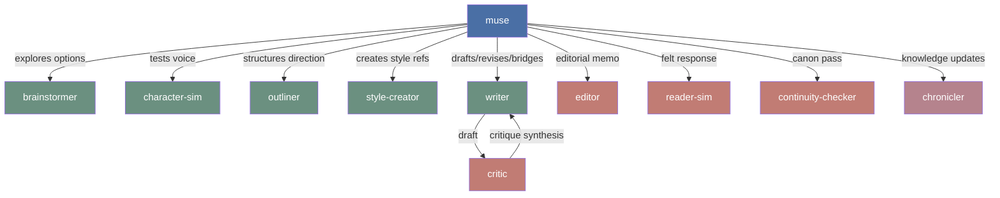
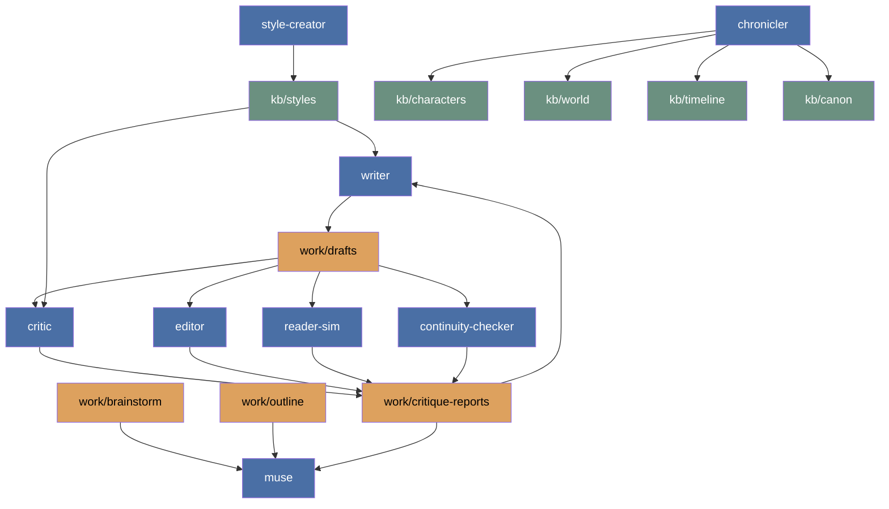

# Package Architecture

Creative-writing-skills uses a compact worker set backed by richer craft skills.
The product thesis is not many near-duplicate writer agents; it is a strong
muse, a few clean cognitive roles, durable story context, and intentional prose
methodology.

## Agent Shape



## Roles

| Agent | Role |
|---|---|
| muse | Author-facing creative partner and coordinator |
| writer | Production prose: fresh drafts, critique-driven revisions, bridges, connective passages, alternate takes, line polish |
| critic | Adversarial craft diagnosis with focused review areas |
| editor | Holistic third-party editorial memo and revision priority |
| reader-sim | Experiential reader response: what it felt like to read |
| continuity-checker | Cross-project canon and terminology contradiction pass |
| brainstormer | Divergent option generation before commitment |
| outliner | Arc/chapter/beat structure after direction is chosen |
| character-sim | In-character simulation and relationship exploration |
| style-creator | Style reference extraction from prose samples |
| chronicler | Story fact, timeline, canon, and terminology extraction into `kb/` |

## Draft Loop

The production loop is intentionally simple:

```text
muse → writer → critic/editor/reader-sim/continuity-checker → writer
```

`writer` owns all prose production modes. Keeping one prose worker preserves
voice continuity better than splitting fresh drafting, bridges, and revision
across separate agents. The stance still changes through the prompt: fresh
draft, surgical revision, bridge, polish, or alternate take.

`critic` stays separate because adversarial diagnosis benefits from fresh
context. `editor` stays separate because holistic editorial prioritization is
not the same mode as focused critique. `reader-sim` stays separate because
reader simulation is not the same mode as craft critique. `continuity-checker` stays separate when canon search
must be broader than the critic's provided context.

## Skill Layer

Skills carry the methodology that makes the smaller agent set work:

| Skill | Purpose |
|---|---|
| creative-writing-modes | Pen-on-paper prose execution modes |
| creative-writing-craft | How-to-write craft library for prose, scenes, style, and genre technique |
| writing-principles | Reader reward channels and AI fiction failure modes |
| story-planning | Direction, brainstorming, outlining, and architecture before drafting |
| story-review | Editorial review, developmental edit, line edit, copyedit, proofreading, critique, and reader-signal synthesis |
| story-memory | Context selection, fact extraction, reference writing, artifacts, and issues |
| reader-sim | Persona-bound first-time reader simulation |
| character-sim | In-character simulation for voice and relationship exploration |
| writing-staffing | Compose compact teams and critic panels |
| llm-writing | Intentional language discipline for fiction and nonfiction artifacts |
| shared-dao | Canonical terminology and vocabulary discipline |

`llm-writing` does not replace prose craft. It catches unchosen defaults:
filler structure, vague language that hides lack of choice, polished transitions
that smooth away tension, and explanation that tells the reader what the scene
should make them feel. In fiction, ambiguity, omission, repetition, and broken
rhythm remain valid when they create the intended effect.

## Artifact Flow


